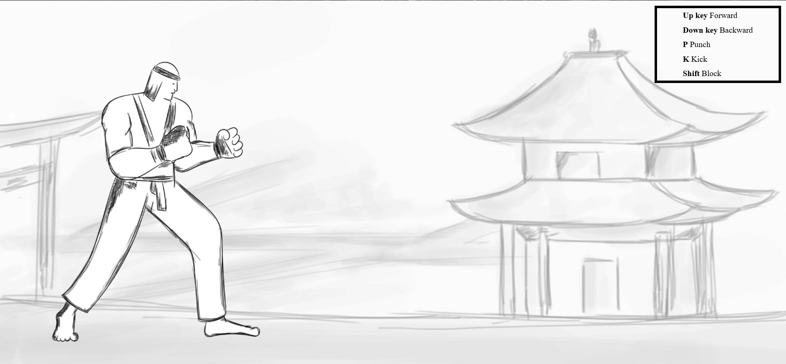
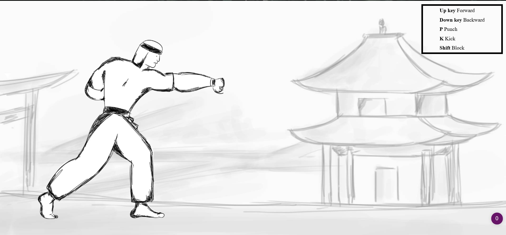
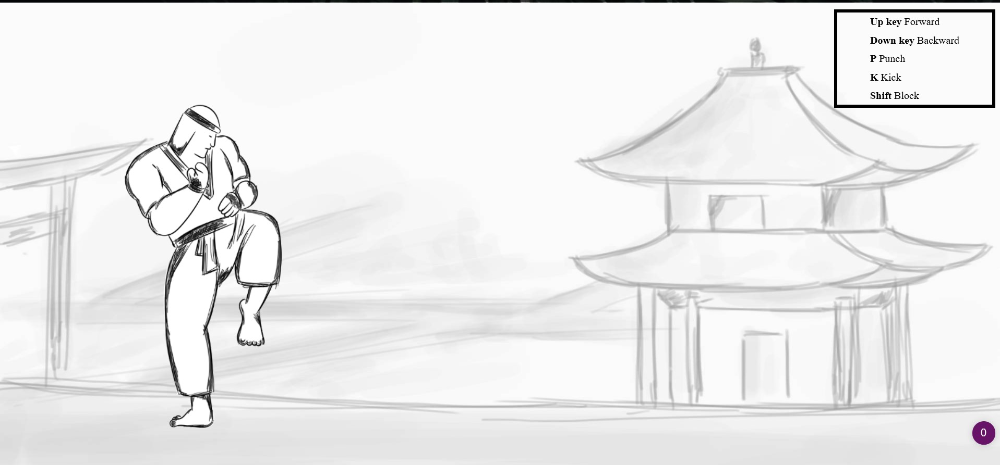
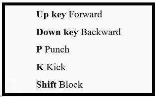

# Fight Simulator

Made a fight simulator that has some basic features that has basic movements like Forward, Backward, Punch, Kick and Block.

## Screenshots

  
  
  
  

## Technology used

1. HTML
2. CSS
3. JS
